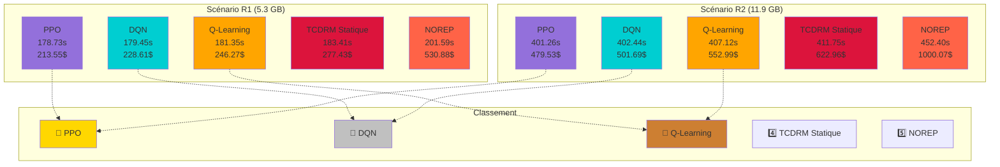
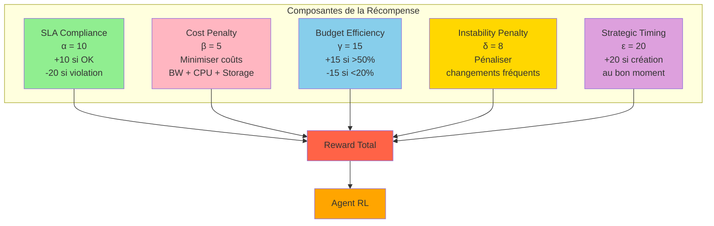

# Diagrammes à Générer Manuellement

Certains diagrammes sont trop complexes pour l'API Mermaid.ink et doivent être générés manuellement.

## Diagrammes Manquants

### 3. Comparaison 5 Modèles

Aller sur https://mermaid.live et coller le code suivant :



Sauvegarder comme : `03_comparaison_5_modèles.png`

---

### 5. Fonction de Récompense Multi-Objectif



Sauvegarder comme : `05_fonction_de_récompense_multi-objectif.png`

---

### 6. Architecture des Résultats

```mermaid
graph TB
    subgraph "Modèles Entraînés"
        QL_MODEL[Q-Learning<br/>results/tcdrm_adaptive/<br/>adaptive_model.pkl]
        DQN_MODEL[DQN<br/>results/dqn/<br/>dqn_model.pt]
        PPO_MODEL[PPO<br/>results/ppo/<br/>ppo_model.zip]
    end
    
    subgraph "Métriques d'Entraînement"
        QL_METRICS[training_metrics.pkl<br/>Reward, Cost, SLA<br/>Replica Changes]
        DQN_METRICS[dqn_training_metrics.pkl<br/>+ Loss]
        PPO_METRICS[ppo_training_metrics.pkl<br/>+ Policy Loss]
    end
    
    subgraph "Graphes de Comparaison"
        COMP_R1[R1 (5.3 GB)<br/>response_time_5curves<br/>total_cost_5curves]
        COMP_R2[R2 (11.9 GB)<br/>response_time_5curves<br/>total_cost_5curves]
    end
    
    QL_MODEL --> COMP_R1
    DQN_MODEL --> COMP_R1
    PPO_MODEL --> COMP_R1
    
    QL_MODEL --> COMP_R2
    DQN_MODEL --> COMP_R2
    PPO_MODEL --> COMP_R2
    
    QL_MODEL -.-> QL_METRICS
    DQN_MODEL -.-> DQN_METRICS
    PPO_MODEL -.-> PPO_METRICS
    
    style QL_MODEL fill:#FFA500
    style DQN_MODEL fill:#00CED1
    style PPO_MODEL fill:#9370DB
    style COMP_R1 fill:#90EE90
    style COMP_R2 fill:#90EE90
```

Sauvegarder comme : `06_architecture_des_résultats.png`

---

## Instructions

1. Ouvrir https://mermaid.live
2. Coller le code Mermaid d'un diagramme
3. Cliquer sur "Download PNG"
4. Sauvegarder dans `docs/diagrams/` avec le nom indiqué

## Alternative : Utiliser les Graphes Générés

Les graphes 5 courbes dans `images/` peuvent aussi être utilisés directement dans la documentation :
- `tcdrm_combined_response_time_R1_5curves_smoothed.png`
- `tcdrm_combined_response_time_R2_5curves_smoothed.png`
- `tcdrm_combined_total_cost_R1_5curves.png`
- `tcdrm_combined_total_cost_R2_5curves.png`

Ces graphes montrent déjà la comparaison des 5 modèles de manière visuelle.
