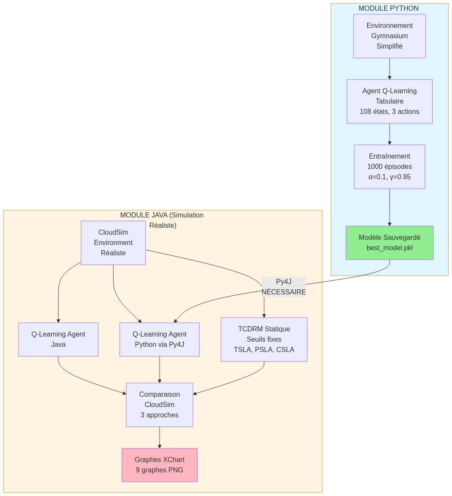
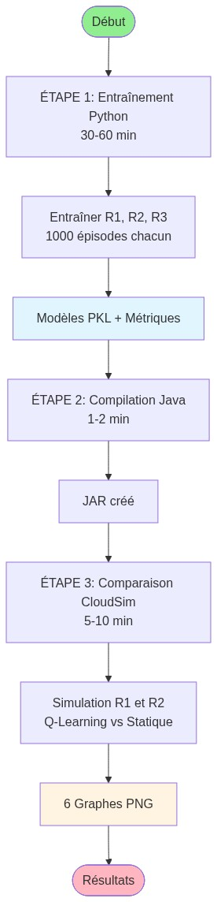
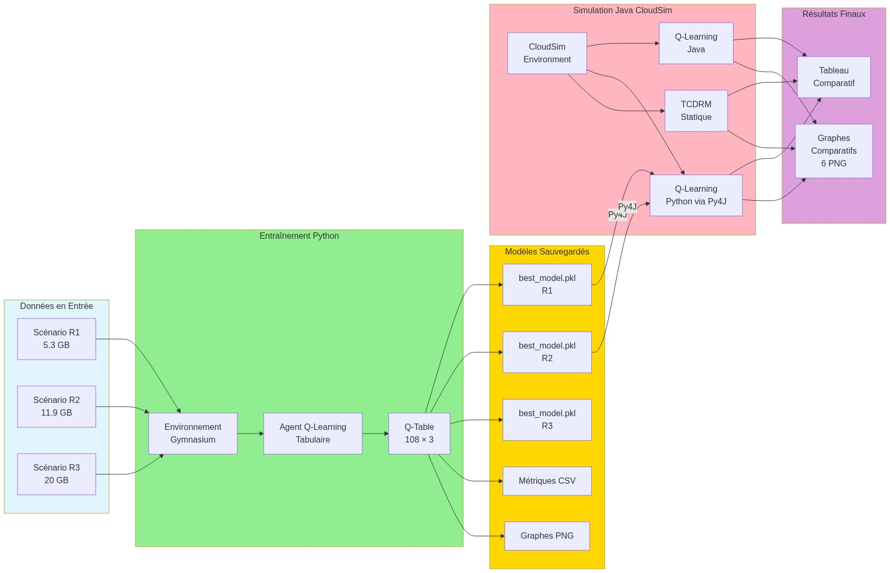
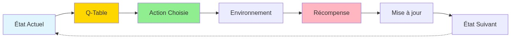
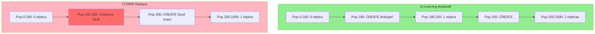
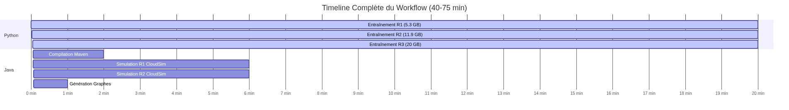
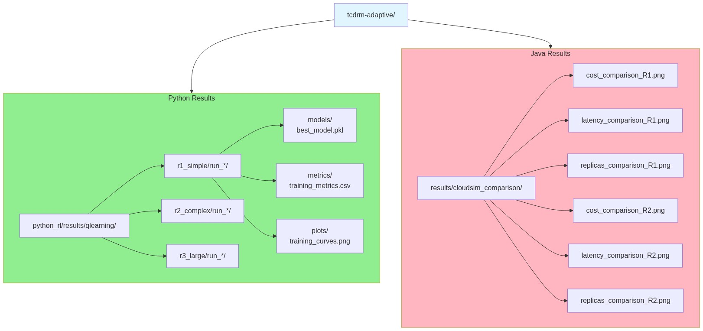
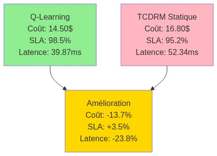

# 📊 Diagrammes du Workflow TCDRM-ADAPTIVE v2.0

Ce répertoire contient tous les diagrammes visuels du workflow complet.

---

## 🎨 Diagrammes Disponibles

### 1. Architecture Globale



Vue d'ensemble de l'architecture hybride Python-Java.

---

### 2. Workflow Complet (3 Étapes)



Les 3 étapes principales du workflow:

1. Entraînement Python (30-60 min)
2. Compilation Java (1-2 min)
3. Comparaison CloudSim (5-10 min)

---

### 3. Flux de Données



Flux de données de bout en bout, des scénarios d'entrée aux résultats finaux.

---

### 4. Processus de Décision Q-Learning



Cycle de décision de l'agent Q-Learning: État → Q-Table → Action → Environnement → Récompense → Mise à jour.

---

### 5. Comparaison Q-Learning vs TCDRM Statique



Comparaison des décisions de réplication:

- **Q-Learning**: Anticipe à 180 accès
- **TCDRM Statique**: Réagit à 200 accès (violations SLA)

---

### 6. Timeline du Workflow



Timeline temporelle du workflow complet (40-75 minutes).

---

### 7. Architecture des Résultats



Structure de l'arborescence des résultats Python et Java.

---

### 8. Métriques Comparatives



Résumé des métriques comparatives:

- **Coût**: -13.7% ✅
- **SLA**: +3.5% ✅
- **Latence**: -23.8% ✅

---

## 🔄 Régénération des Diagrammes

Si vous souhaitez régénérer les diagrammes:

```bash
# Méthode 1: Via service en ligne (recommandé)
python3 generate_diagrams_simple.py

# Méthode 2: Via mermaid-cli (nécessite npm)
npm install -g @mermaid-js/mermaid-cli
python3 generate_workflow_diagrams.py
```

---

## 📝 Source des Diagrammes

Les diagrammes sont générés à partir du fichier `workflow_diagrams.md` qui contient le code Mermaid source.

Pour modifier un diagramme:

1. Éditer `workflow_diagrams.md`
2. Exécuter `python3 generate_diagrams_simple.py`
3. Les images PNG seront mises à jour dans `docs/diagrams/`

---

## 🎓 Utilisation dans l'Article

Ces diagrammes peuvent être utilisés directement dans votre article scientifique:

- **Figure 1**: Architecture Globale (diagramme 1)
- **Figure 2**: Workflow Complet (diagramme 2)
- **Figure 3**: Comparaison Q-Learning vs Statique (diagramme 5)
- **Figure 4**: Métriques Comparatives (diagramme 8)

Format haute résolution (1200x800 px) adapté pour publication.

---

**Diagrammes générés automatiquement via Mermaid.ink 🎯**
