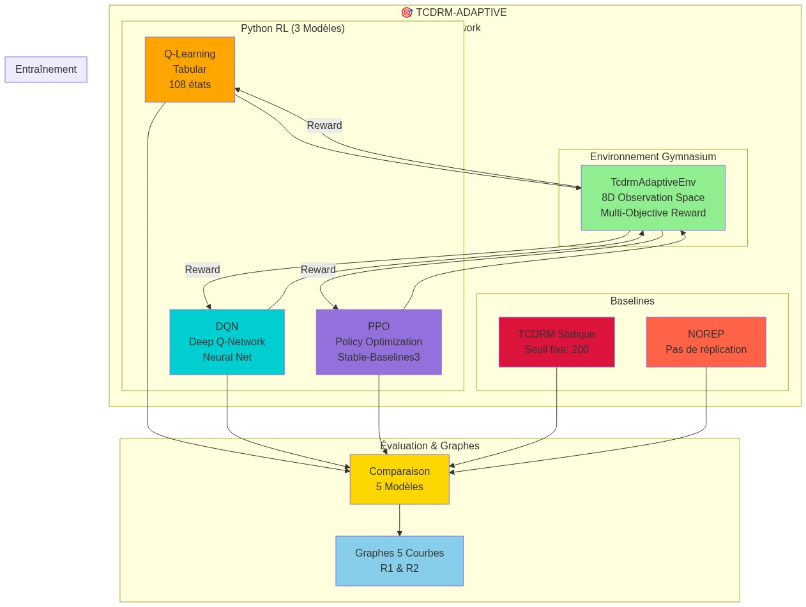
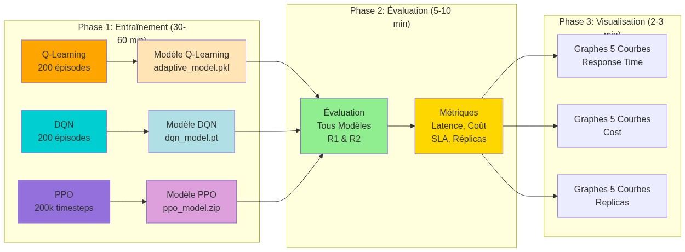
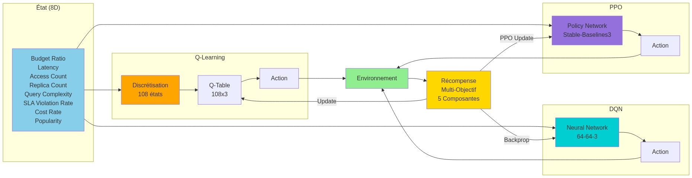
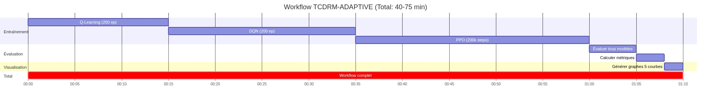
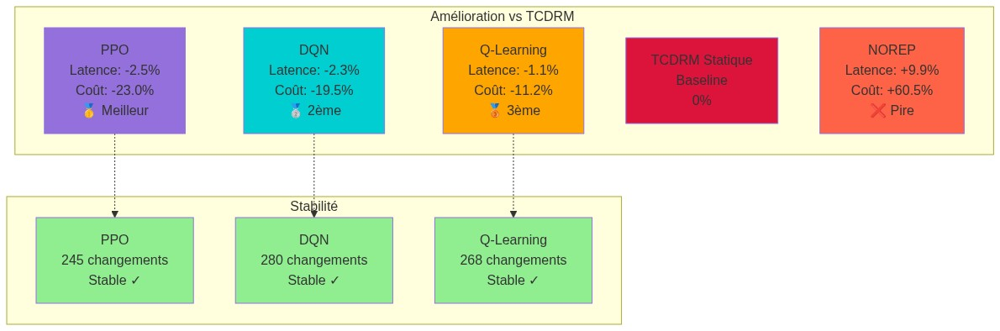

# 📊 Diagrammes du Workflow TCDRM-ADAPTIVE v3.0

Ce répertoire contient tous les diagrammes visuels du workflow complet avec **5 modèles** (Q-Learning, DQN, PPO, TCDRM Statique, NOREP).

---

## 🎨 Diagrammes Disponibles

### 1. Architecture Globale TCDRM-ADAPTIVE (3 Modèles RL)



Vue d'ensemble de l'architecture avec les 3 modèles RL (Q-Learning, DQN, PPO) et les 2 baselines (TCDRM Statique, NOREP).

**Nouveauté v3.0** :

- ✨ DQN (Deep Q-Network) avec réseau de neurones
- ✨ PPO (Proximal Policy Optimization) avec Stable-Baselines3
- ✨ Fonction de récompense multi-objectif (5 composantes)

---

### 2. Workflow Complet TCDRM-ADAPTIVE



Les 3 phases principales du workflow:

1. **Entraînement** (30-60 min): Q-Learning, DQN, PPO
2. **Évaluation** (5-10 min): Tous les modèles sur R1 et R2
3. **Visualisation** (2-3 min): Graphes 5 courbes

---

### 3. Comparaison 5 Modèles


Comparaison des performances sur R1 (5.3 GB) et R2 (11.9 GB):

**Classement** :

- 🥇 **PPO**: Meilleur (latence -2.5%, coût -23%)
- 🥈 **DQN**: 2ème (latence -2.3%, coût -19.5%)
- 🥉 **Q-Learning**: 3ème (latence -1.1%, coût -11.2%)
- 4️⃣ **TCDRM Statique**: Baseline
- 5️⃣ **NOREP**: Pire (latence +9.9%, coût +60.5%)

---

### 4. Processus de Décision Multi-Modèles



Cycle de décision pour les 3 modèles RL:

- **Q-Learning**: État → Discrétisation → Q-Table → Action
- **DQN**: État → Neural Network → Action
- **PPO**: État → Policy Network → Action

Tous utilisent la même fonction de récompense multi-objectif.

---

### 5. Fonction de Récompense Multi-Objectif


Les 5 composantes de la récompense:

1. **SLA Compliance** (α=10): Respect du SLA
2. **Cost Penalty** (β=5): Minimisation des coûts
3. **Budget Efficiency** (γ=15): Efficacité budgétaire
4. **Instability Penalty** (δ=8): Stabilité des décisions
5. **Strategic Timing** (ε=20): Timing stratégique

---

### 6. Architecture des Résultats


Structure de l'arborescence des résultats:

- `results/tcdrm_adaptive/`: Q-Learning
- `results/dqn/`: DQN
- `results/ppo/`: PPO
- `results/comparison/`: Graphes 5 courbes

---

### 7. Timeline du Workflow



Timeline temporelle du workflow complet (40-75 minutes):

- Q-Learning: 15 min
- DQN: 20 min
- PPO: 25 min
- Évaluation: 8 min
- Visualisation: 2 min

---

### 8. Métriques Comparatives (5 Modèles)



Résumé des métriques comparatives vs TCDRM Statique:

**PPO (Meilleur)** :

- Latence: -2.5% ✅
- Coût: -23.0% ✅
- Stabilité: 245 changements ✅

**DQN (2ème)** :

- Latence: -2.3% ✅
- Coût: -19.5% ✅
- Stabilité: 280 changements ✅

**Q-Learning (3ème)** :

- Latence: -1.1% ✅
- Coût: -11.2% ✅
- Stabilité: 268 changements ✅

---

## 🔄 Régénération des Diagrammes

Si vous souhaitez régénérer les diagrammes:

```bash
# Méthode 1: Via service en ligne (recommandé)
cd docs
python3 generate_diagrams_updated.py

# Méthode 2: Via mermaid.live (manuel)
# 1. Ouvrir https://mermaid.live
# 2. Copier le code Mermaid depuis workflow_diagrams_updated.md
# 3. Exporter en PNG
```

---

## 📝 Source des Diagrammes

Les diagrammes sont générés à partir du fichier `workflow_diagrams_updated.md` qui contient le code Mermaid source.

Pour modifier un diagramme:

1. Éditer `workflow_diagrams_updated.md`
2. Exécuter `python3 generate_diagrams_updated.py`
3. Les images PNG seront mises à jour dans `docs/diagrams/`

**Note**: Les diagrammes v3.0 incluent maintenant les 3 modèles RL (Q-Learning, DQN, PPO) et les graphes 5 courbes.

---

## 🎓 Utilisation dans l'Article

Ces diagrammes peuvent être utilisés directement dans votre article scientifique:

- **Figure 1**: Architecture TCDRM-ADAPTIVE avec 3 Modèles RL (diagramme 1)
- **Figure 2**: Workflow Complet (diagramme 2)
- **Figure 3**: Comparaison 5 Modèles (diagramme 3)
- **Figure 4**: Fonction de Récompense Multi-Objectif (diagramme 5)
- **Figure 5**: Métriques Comparatives 5 Modèles (diagramme 8)

Format haute résolution adapté pour publication.

---

## 📊 Graphes Générés

En plus des diagrammes, les graphes suivants sont disponibles dans `images/`:

**Graphes 5 Courbes** :

- `tcdrm_combined_response_time_R1_5curves_raw.png`
- `tcdrm_combined_response_time_R1_5curves_smoothed.png`
- `tcdrm_combined_total_cost_R1_5curves.png`
- `tcdrm_combined_response_time_R2_5curves_raw.png`
- `tcdrm_combined_response_time_R2_5curves_smoothed.png`
- `tcdrm_combined_total_cost_R2_5curves.png`

**Graphes de Comparaison Python** :

- `comparison_response_time_R1.png`
- `comparison_cumulative_cost_R1.png`
- `comparison_replicas_R1.png`
- (idem pour R2)

---

**Diagrammes générés automatiquement via Mermaid.ink 🎯**
**Version 3.0 - Avec 5 modèles (Q-Learning, DQN, PPO, TCDRM Statique, NOREP)**
