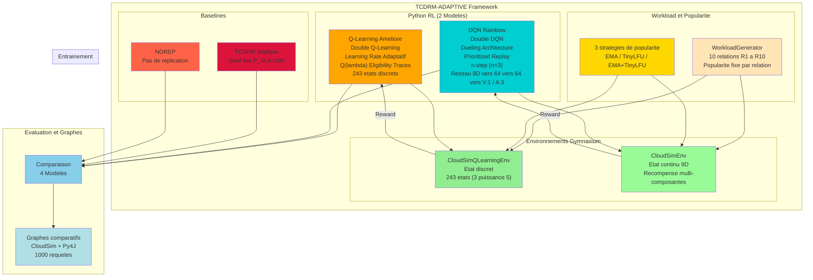
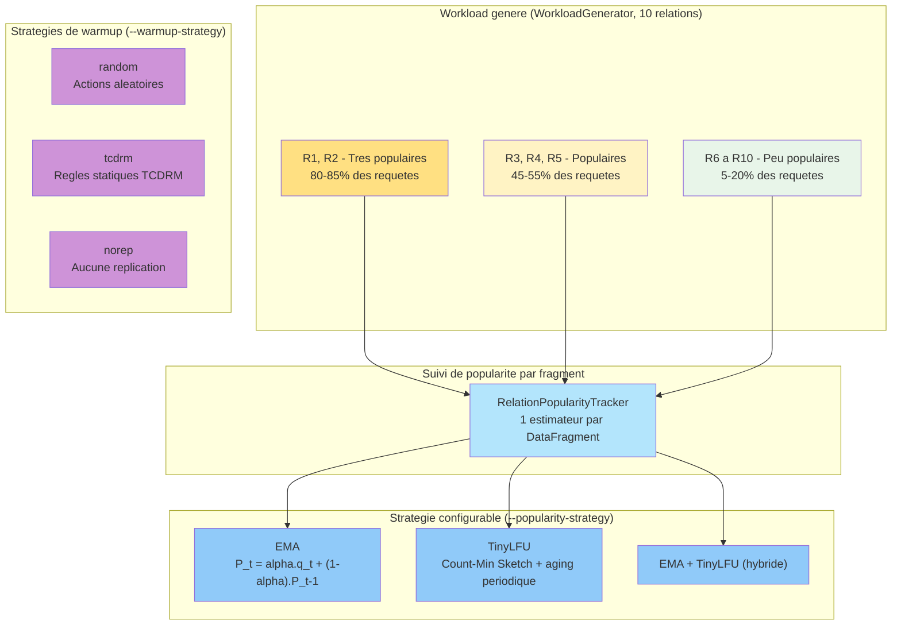
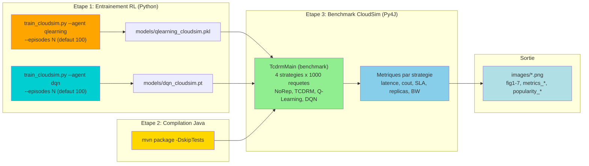
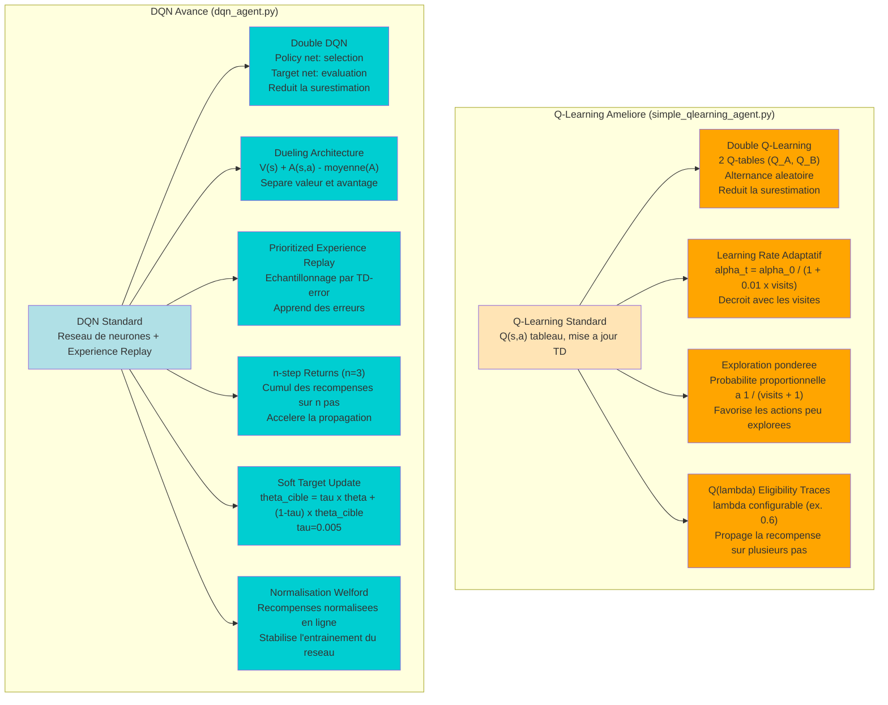
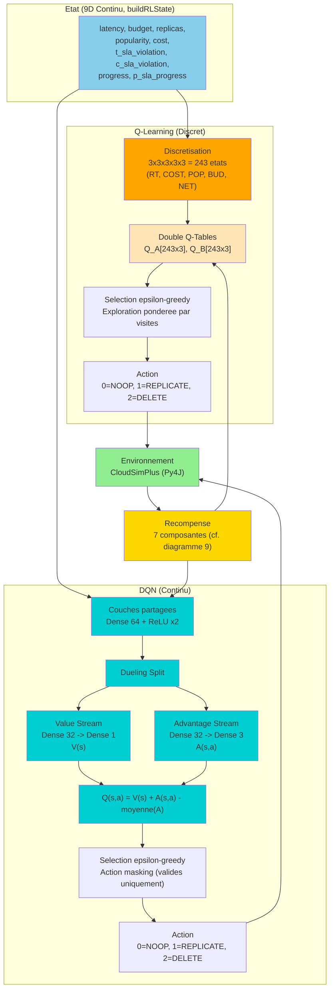
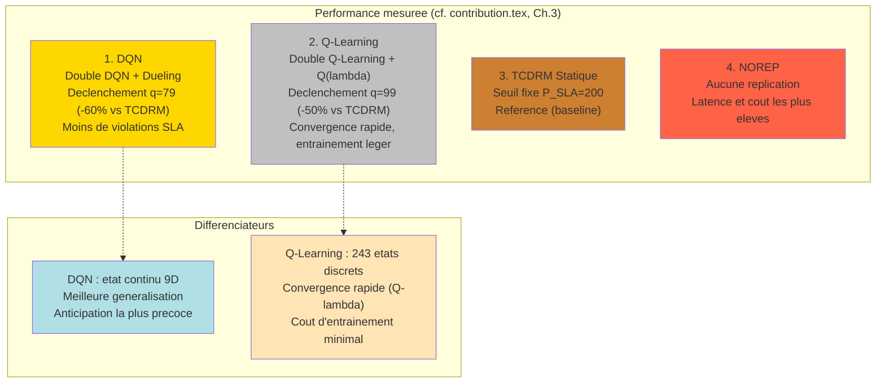
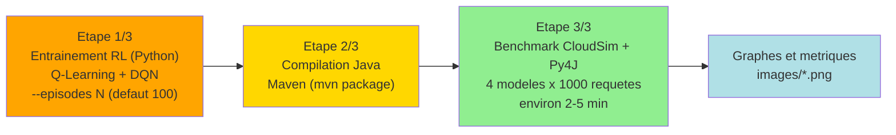
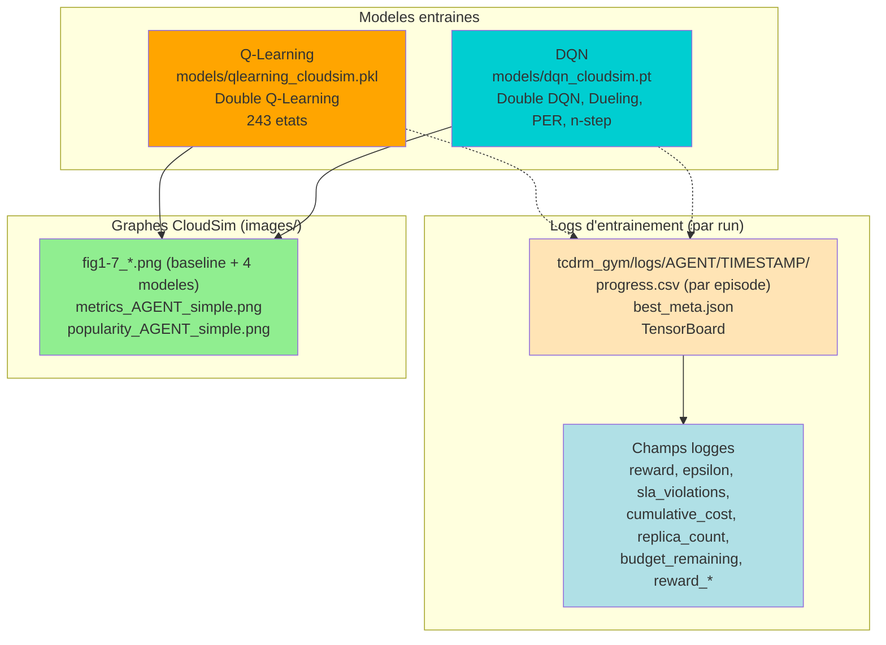
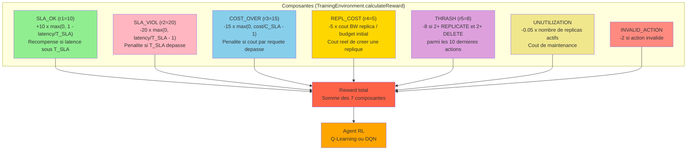
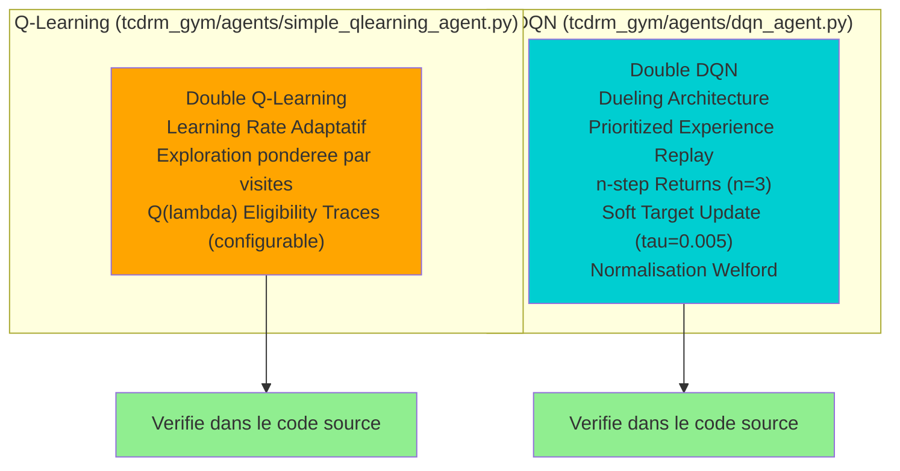

# Diagrammes TCDRM-ADAPTIVE 2024 (Mis à jour — alignés sur le code)

> Ce document contient les 10 diagrammes (`docs/diagrams/`). Chaque diagramme
> est vérifié contre le code source (`tcdrm_gym/agents/`, `tcdrm_gym/envs/`,
> `src/main/java/.../training/TrainingEnvironment.java`). Les diagrammes 3, 4
> et 5 avaient initialement échoué à la génération (erreurs 403/503/400 de
> l'API `mermaid.ink`) — ils sont désormais générés en local via Mermaid CLI
> et ont été corrigés au passage pour correspondre au code actuel.

## 1. Architecture Globale TCDRM-ADAPTIVE (2 Modèles RL)

**Vérifié contre** : `tcdrm_gym/envs/cloudsim_env.py` (`CloudSimQLearningEnv`, `CloudSimEnv`, état 9D), `tcdrm_gym/agents/simple_qlearning_agent.py`, `tcdrm_gym/agents/dqn_agent.py` (`DuelingDQNNetwork`, `hidden_dims=[64,64]`), `src/main/java/.../data/WorkloadGenerator.java` (10 relations).

---

## 2. Modèle de Workload et Stratégies de Popularité

**Note** : ce diagramme remplace l'ancienne version "11 patterns cloud réels"
(`steady`, `burst`, `read_intensive`, `black_friday`, etc.), qui ne correspond
à aucun code existant dans le projet. Le workload réel est généré par
`WorkloadGenerator.java` (10 relations à popularité fixe) et la popularité est
suivie par fragment via `RelationPopularityTracker` / `TinyLFU.java`, avec un
choix de stratégie au lancement (`--popularity-strategy EMA|TINYLFU|EMA_TINYLFU`).

---

## 3. Workflow Détaillé (Entraînement → Compilation → Benchmark)

**Vérifié contre** : `tcdrm_gym/train_cloudsim.py` (CLI `--agent`, `--episodes`),
`tcdrm_gym/config.yml` (chemins des modèles), `run_complete_workflow.sh`
(étapes Maven puis benchmark Py4J). Complète le diagramme 7 (vue Gantt/pipeline)
avec le détail des artefacts produits à chaque étape.

---

## 4. Techniques d'Amélioration des Algorithmes RL

**Vérifié contre** : `tcdrm_gym/agents/simple_qlearning_agent.py` (Double
Q-Learning, `adaptive_lr`, exploration pondérée par `visit_counts`,
`lambda_trace`) et `tcdrm_gym/agents/dqn_agent.py` (`use_double_dqn`,
`DuelingDQNNetwork`, `PrioritizedReplayBuffer`, `NStepBuffer`, `tau`,
`RunningMeanStd`). La version précédente de ce diagramme omettait Q(λ),
n-step et la normalisation Welford, pourtant bien présents dans le code.

---

## 5. Processus de Décision (Q-Learning vs DQN)

**Vérifié contre** : `tcdrm_gym/envs/cloudsim_env.py` (état 9D,
`CloudSimQLearningEnv._discretize_state` pour la discrétisation 3⁵),
`tcdrm_gym/agents/dqn_agent.py` (`DuelingDQNNetwork`). La version précédente
indiquait un état 8D avec des noms de variables fictifs (`Budget Ratio,
Access Count, Query Complexity...`) ; corrigé pour correspondre exactement à
`buildRLState()`.

---

## 6. Comparaison 4 Modèles (Sans PPO)

**Note** : l'ancienne version classait les modèles par pattern de charge
fictif (`geo_distributed`, `black_friday`, `read_intensive`...). Le classement
est remplacé par les résultats mesurés et reproductibles présentés dans
`overleaf/contribution.tex` (Section 4 — Résultats expérimentaux).

---

## 7. Workflow Complet (run-complete-workflow)

**Vérifié contre** : `run_complete_workflow.sh` (`STEP 1/3` entraînement,
`STEP 2/3` compilation Maven, `STEP 3/3` benchmark Py4J ; option `--episodes`,
défaut 100 ; commentaire du script : phase benchmark ≈ 2-5 min pour 4
scénarios × 1000 requêtes).

---

## 8. Architecture des Résultats

**Vérifié contre** : `tcdrm_gym/config.yml` (chemins des modèles),
`tcdrm_gym/train_cloudsim.py` (`CSVLogger`, `ensure_log_dir`, champs CSV),
`tcdrm-adaptive/images/` (fichiers `fig*.png`, `metrics_*_simple.png`,
`popularity_*_simple.png` réellement présents). Les anciennes références à
`ANALYSE_DOUBLE_DQN_ET_PATTERNS.md`, `PATTERNS_CLOUD_IMPLEMENTES.md` et
`MODIFICATIONS_ENTRAINEMENT.md` ont été retirées : ces fichiers n'existent pas
dans le dépôt.

---

## 9. Fonction de Récompense

**Vérifié contre** : `src/main/java/org/tcdrm/adaptive/training/TrainingEnvironment.java`,
méthode `calculateReward()` (commentaire de code :
`R = r1·SLA_OK − r2·SLA_VIOL − r3·COST_OVER − r4·REPL_COST − r5·THRASH`,
complété par `rewardUnutilization` et `rewardInvalidAction`). L'ancienne
version (composantes `ALPHA/BETA/GAMMA/DELTA/EPSILON/ZETA/ETA`, valeurs
15/6/18/10/25/15/12) ne correspond à aucune implémentation présente dans le
code et a été remplacée.

---

## 10. Techniques RL Implémentées (Vérification Code)

**Note** : l'ancienne version renvoyait à `algo.md` et à des numéros de ligne
précis dans le code (ex. "Ligne 134-161"). `algo.md` a été supprimé du dépôt
(fichier de notes redondant) et les numéros de ligne deviennent obsolètes dès
la moindre modification du fichier ; ce diagramme renvoie donc aux noms de
fichiers/techniques uniquement, plus stables dans le temps.

---

## Résumé des Modifications

### Algorithmes RL

- **Q-Learning** (`simple_qlearning_agent.py`) : Double Q-Learning, learning rate adaptatif, exploration pondérée par visites, traces d'éligibilité Q(λ) — 243 états discrets (3⁵).
- **DQN** (`dqn_agent.py`) : Double DQN, Dueling, Prioritized Experience Replay, n-step returns (n=3), soft target update (τ=0.005), normalisation des récompenses (Welford) — état continu 9D.
- **PPO** : non implémenté dans ce projet (absent du code, donc absent des diagrammes).

### Workload et Popularité

- 10 relations (`R1`-`R10`) à popularité fixe générées par `WorkloadGenerator.java` — pas de "11 patterns cloud" (steady/burst/black_friday/...), qui ne correspondent à aucun code du dépôt.
- 3 stratégies de popularité interchangeables : EMA, TinyLFU (Count-Min Sketch), hybride EMA+TinyLFU.
- 3 stratégies de warmup : `random`, `tcdrm`, `norep`.

### Fonction de récompense

- 7 composantes réelles calculées dans `TrainingEnvironment.calculateReward()` : SLA_OK, SLA_VIOL, COST_OVER, REPL_COST, THRASH, UNUTILIZATION, INVALID_ACTION.

### Documentation

- Suppression des références à des fichiers `.md` inexistants (`ANALYSE_DOUBLE_DQN_ET_PATTERNS.md`, `PATTERNS_CLOUD_IMPLEMENTES.md`, `MODIFICATIONS_ENTRAINEMENT.md`, `algo.md`).
- 10 diagrammes générés (1 à 10). Les diagrammes 3, 4 et 5, qui échouaient
  auparavant à la génération (erreurs API), ont été corrigés et régénérés
  avec succès en local via Mermaid CLI.
