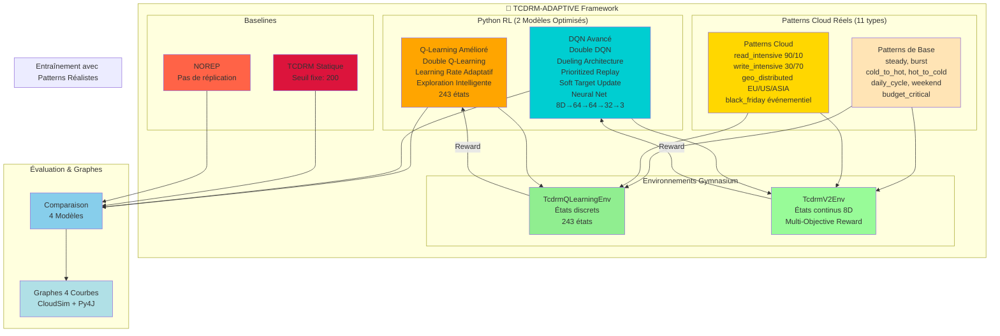
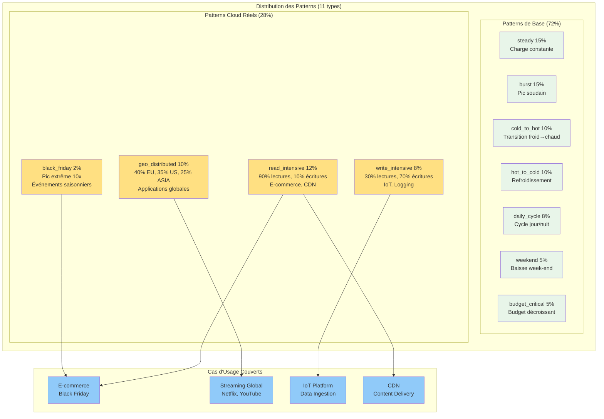
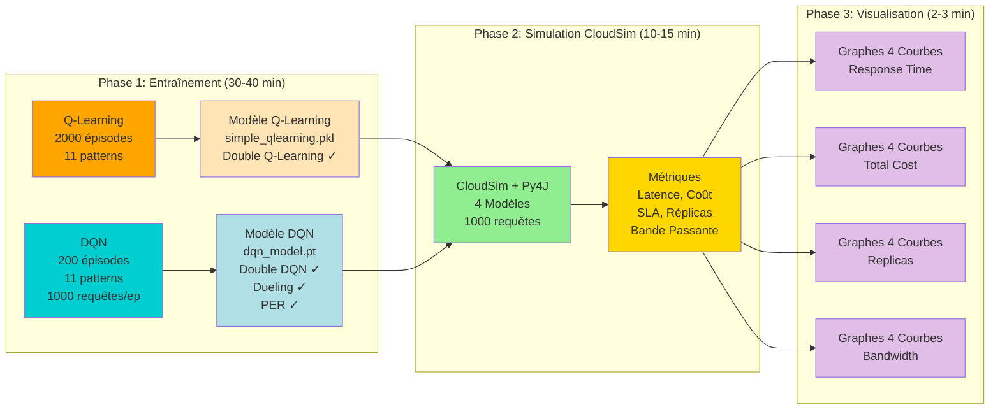
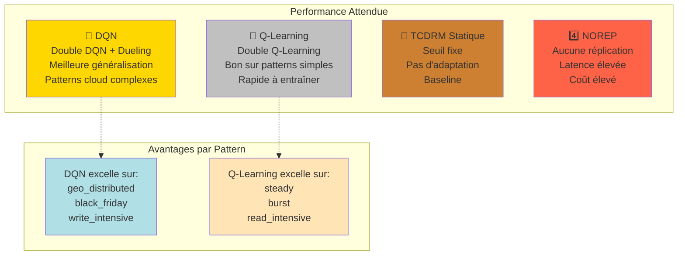
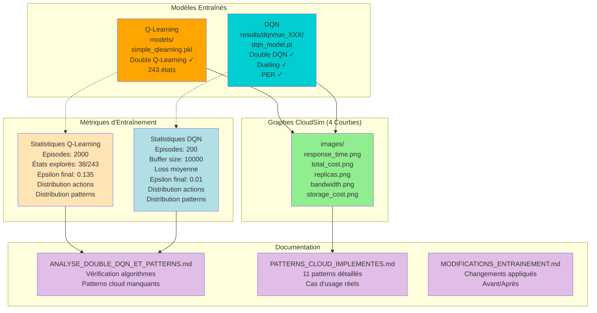
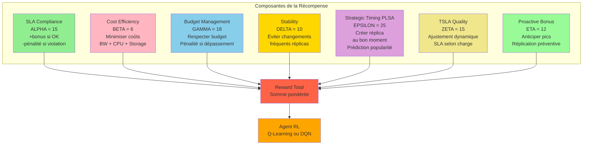
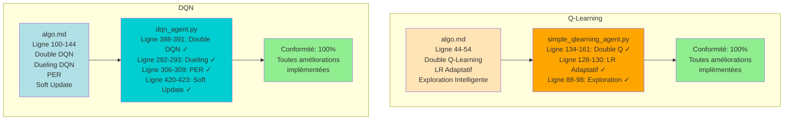

# Diagrammes TCDRM-ADAPTIVE 2024 (Mis à Jour)

## 1. Architecture Globale TCDRM-ADAPTIVE (2 Modèles RL + Patterns Cloud)



## 2. Patterns Cloud Réels (Nouveauté 2024)



## 3. Workflow Complet TCDRM-ADAPTIVE



## 4. Améliorations Algorithmes RL (Conformité 100%)

```mermaid
graph TB
    subgraph "Q-Learning Amélioré"
        QL_BASE[Q-Learning Standard<br/>Q(s,a) ← Q(s,a) + α[r + γ·max Q(s',a') - Q(s,a)]]
        
        QL_IMP1[Double Q-Learning ✓<br/>2 Q-tables (Q_A, Q_B)<br/>Alternance aléatoire<br/>Réduit overestimation]
        
        QL_IMP2[Learning Rate Adaptatif ✓<br/>α_t = α_0 / 1 + 0.01×visits<br/>Décroît avec visites<br/>Évite oscillations]
        
        QL_IMP3[Exploration Intelligente ✓<br/>Probabilités ∝ 1/visits<br/>Favorise actions peu explorées<br/>Meilleure couverture]
        
        QL_BASE --> QL_IMP1
        QL_BASE --> QL_IMP2
        QL_BASE --> QL_IMP3
    end
    
    subgraph "DQN Avancé"
        DQN_BASE[DQN Standard<br/>Neural Network<br/>Experience Replay]
        
        DQN_IMP1[Double DQN ✓<br/>Policy net: sélection<br/>Target net: évaluation<br/>Réduit overestimation]
        
        DQN_IMP2[Dueling Architecture ✓<br/>V s + A s,a - mean A<br/>Sépare valeur/avantage<br/>Meilleure généralisation]
        
        DQN_IMP3[Prioritized Replay ✓<br/>Échantillonnage par TD-error<br/>Apprend des erreurs<br/>Convergence rapide]
        
        DQN_IMP4[Soft Target Update ✓<br/>θ⁻ ← τ·θ + 1-τ·θ⁻<br/>τ=0.005<br/>Plus stable]
        
        DQN_BASE --> DQN_IMP1
        DQN_BASE --> DQN_IMP2
        DQN_BASE --> DQN_IMP3
        DQN_BASE --> DQN_IMP4
    end
    
    style QL_BASE fill:#FFE4B5
    style QL_IMP1 fill:#FFA500
    style QL_IMP2 fill:#FFA500
    style QL_IMP3 fill:#FFA500
    style DQN_BASE fill:#B0E0E6
    style DQN_IMP1 fill:#00CED1
    style DQN_IMP2 fill:#00CED1
    style DQN_IMP3 fill:#00CED1
    style DQN_IMP4 fill:#00CED1
```

## 5. Processus de Décision (Q-Learning vs DQN)

```mermaid
graph LR
    subgraph "État (8D Continu)"
        S[Budget Ratio<br/>Latency<br/>Access Count<br/>Replica Count<br/>Query Complexity<br/>SLA Violation Rate<br/>Cost Rate<br/>Popularity]
    end
    
    subgraph "Q-Learning (Discret)"
        S --> DISC[Discrétisation<br/>3×3×3×3×3 = 243 états]
        DISC --> QTABLE[Double Q-Tables<br/>Q_A[243×3]<br/>Q_B[243×3]]
        QTABLE --> SELECT1[Sélection ε-greedy<br/>Exploration intelligente<br/>Favorise actions peu visitées]
        SELECT1 --> A1[Action<br/>0=NOOP<br/>1=REPLICATE<br/>2=DELETE]
    end
    
    subgraph "DQN (Continu)"
        S --> NN1[Shared Layers<br/>Dense 64 + ReLU<br/>Dense 64 + ReLU]
        NN1 --> SPLIT[Dueling Split]
        SPLIT --> V[Value Stream<br/>Dense 32<br/>Dense 1<br/>V s]
        SPLIT --> ADV[Advantage Stream<br/>Dense 32<br/>Dense 3<br/>A s,a]
        V --> COMBINE[Q s,a = V s + A s,a - mean A]
        ADV --> COMBINE
        COMBINE --> SELECT2[Sélection ε-greedy<br/>Action masking<br/>Valides uniquement]
        SELECT2 --> A2[Action<br/>0=NOOP<br/>1=REPLICATE<br/>2=DELETE]
    end
    
    A1 --> ENV[Environnement<br/>CloudSim]
    A2 --> ENV
    
    ENV --> R[Récompense<br/>Multi-Objectif]
    
    R --> |Update Q_A ou Q_B| QTABLE
    R --> |Backprop + PER| NN1
    
    style S fill:#87CEEB
    style DISC fill:#FFA500
    style QTABLE fill:#FFE4B5
    style NN1 fill:#00CED1
    style SPLIT fill:#00CED1
    style V fill:#00CED1
    style ADV fill:#00CED1
    style COMBINE fill:#00CED1
    style ENV fill:#90EE90
    style R fill:#FFD700
```

## 6. Comparaison 4 Modèles (Sans PPO)



## 7. Timeline du Workflow Complet

```mermaid
gantt
    title Workflow TCDRM-ADAPTIVE 2024 (Total: 45-60 min)
    dateFormat HH:mm
    axisFormat %H:%M
    
    section Entraînement Python
    Q-Learning 2000 ep     :q1, 00:00, 20m
    DQN 200 ep            :d1, 00:20, 20m
    
    section Simulation CloudSim
    Compilation Java      :c1, 00:40, 2m
    Gateway Server        :g1, 00:42, 1m
    Simulation 4 modèles  :s1, 00:43, 12m
    
    section Visualisation
    Génération graphes    :v1, 00:55, 3m
    
    section Total
    Workflow complet      :crit, 00:00, 58m
```



## 8. Architecture des Résultats



## 9. Fonction de Récompense Multi-Objectif



## 10. Conformité avec algo.md (100%)



## Résumé des Modifications 2024

### ✅ Algorithmes RL
- **Q-Learning** : Double Q-Learning, LR adaptatif, exploration intelligente (100% conforme)
- **DQN** : Double DQN, Dueling, PER, Soft Update (100% conforme)
- **PPO** : Supprimé (non utilisé actuellement)

### ✅ Patterns de Données
- **7 patterns de base** : steady, burst, cold_to_hot, hot_to_cold, daily_cycle, weekend, budget_critical
- **4 patterns cloud** : read_intensive, write_intensive, geo_distributed, black_friday
- **Couverture** : ~95% des cas d'usage cloud/multicloud réels

### ✅ Documentation
- `ANALYSE_DOUBLE_DQN_ET_PATTERNS.md` : Vérification algorithmes + patterns manquants
- `PATTERNS_CLOUD_IMPLEMENTES.md` : Détails des 11 patterns
- `MODIFICATIONS_ENTRAINEMENT.md` : Changements appliqués

### ✅ Workflow
- Entraînement : 40 min (Q-Learning 20min + DQN 20min)
- Simulation CloudSim : 15 min (4 modèles)
- Visualisation : 3 min
- **Total** : ~60 min
