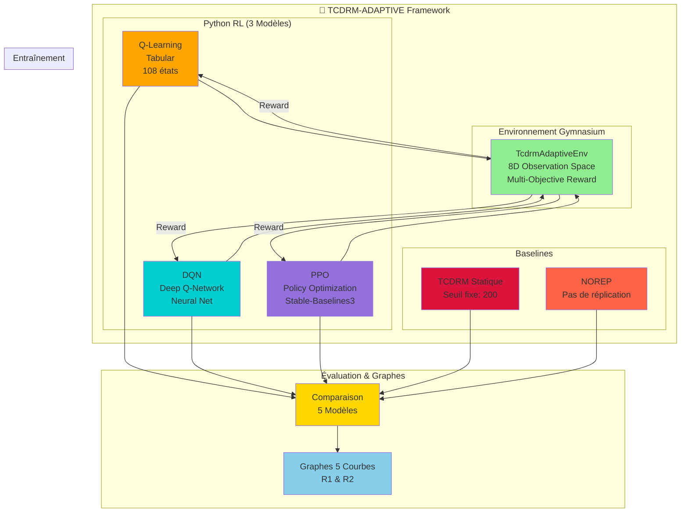
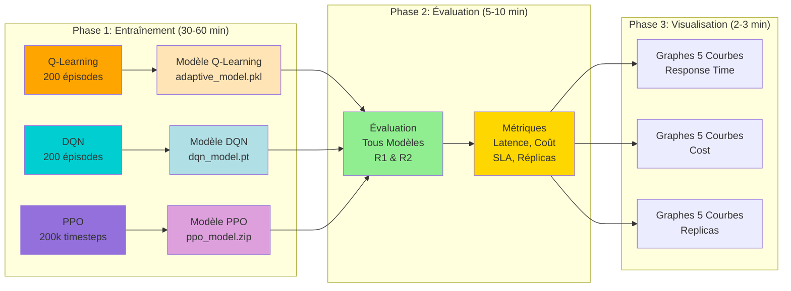
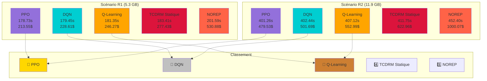
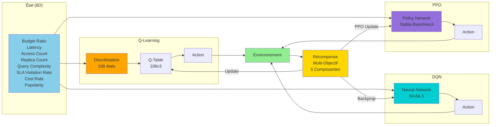
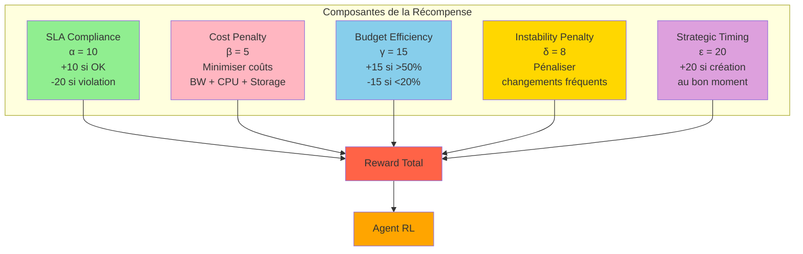
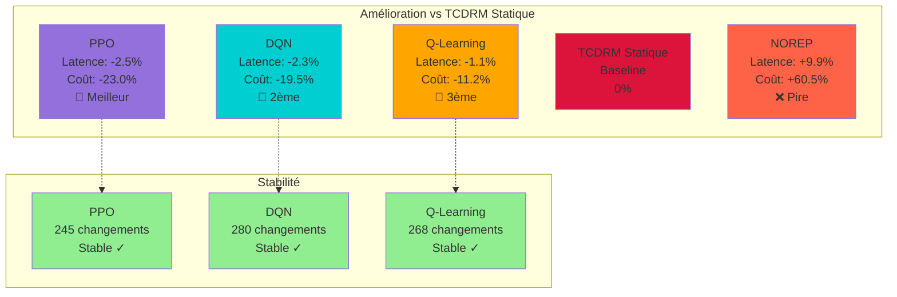

# Diagrammes TCDRM-ADAPTIVE Mis à Jour

## 1. Architecture Globale TCDRM-ADAPTIVE (3 Modèles RL)



## 2. Workflow Complet TCDRM-ADAPTIVE



## 3. Comparaison 5 Modèles



## 4. Processus de Décision Multi-Modèles



## 5. Fonction de Récompense Multi-Objectif



## 6. Architecture des Résultats

```mermaid
graph TB
    subgraph "Modèles Entraînés"
        QL_MODEL[Q-Learning<br/>results/tcdrm_adaptive/<br/>adaptive_model.pkl]
        DQN_MODEL[DQN<br/>results/dqn/<br/>dqn_model.pt]
        PPO_MODEL[PPO<br/>results/ppo/<br/>ppo_model.zip]
    end
    
    subgraph "Métriques d'Entraînement"
        QL_METRICS[training_metrics.pkl<br/>Reward, Cost, SLA<br/>Replica Changes]
        DQN_METRICS[dqn_training_metrics.pkl<br/>+ Loss]
        PPO_METRICS[ppo_training_metrics.pkl<br/>+ Policy Loss]
    end
    
    subgraph "Graphes de Comparaison"
        COMP_R1[R1 (5.3 GB)<br/>response_time_5curves<br/>total_cost_5curves]
        COMP_R2[R2 (11.9 GB)<br/>response_time_5curves<br/>total_cost_5curves]
    end
    
    QL_MODEL --> COMP_R1
    DQN_MODEL --> COMP_R1
    PPO_MODEL --> COMP_R1
    
    QL_MODEL --> COMP_R2
    DQN_MODEL --> COMP_R2
    PPO_MODEL --> COMP_R2
    
    QL_MODEL -.-> QL_METRICS
    DQN_MODEL -.-> DQN_METRICS
    PPO_MODEL -.-> PPO_METRICS
    
    style QL_MODEL fill:#FFA500
    style DQN_MODEL fill:#00CED1
    style PPO_MODEL fill:#9370DB
    style COMP_R1 fill:#90EE90
    style COMP_R2 fill:#90EE90
```

## 7. Timeline du Workflow Complet

```mermaid
gantt
    title Workflow TCDRM-ADAPTIVE (Total: 40-75 min)
    dateFormat HH:mm
    axisFormat %H:%M
    
    section Entraînement
    Q-Learning (200 ep)     :q1, 00:00, 15m
    DQN (200 ep)           :d1, 00:15, 20m
    PPO (200k steps)       :p1, 00:35, 25m
    
    section Évaluation
    Évaluer tous modèles   :e1, 01:00, 5m
    Calculer métriques     :e2, 01:05, 3m
    
    section Visualisation
    Générer graphes 5 courbes :v1, 01:08, 2m
    
    section Total
    Workflow complet       :crit, 00:00, 70m
```



## 8. Métriques Comparatives (5 Modèles)


