# TCDRM-ADAPTIVE : Analyse des Résultats Expérimentaux

Ce document présente l'ensemble des graphiques générés par le projet TCDRM-ADAPTIVE, avec une interprétation détaillée de chaque figure.

---

## Table des Matières

1. [Figures du Papier Original (TCDRM vs NoRepLc)](#1-figures-du-papier-original-tcdrm-vs-noreplc)
2. [Figures de l'Extension RL (4 modèles)](#2-figures-de-lextension-rl-4-modèles)
3. [Métriques Détaillées par Modèle](#3-métriques-détaillées-par-modèle)
4. [Analyse de la Popularité](#4-analyse-de-la-popularité)

---

## 1. Figures du Papier Original (TCDRM vs NoRepLc)

### Figure 2 : Facteur de Réplication

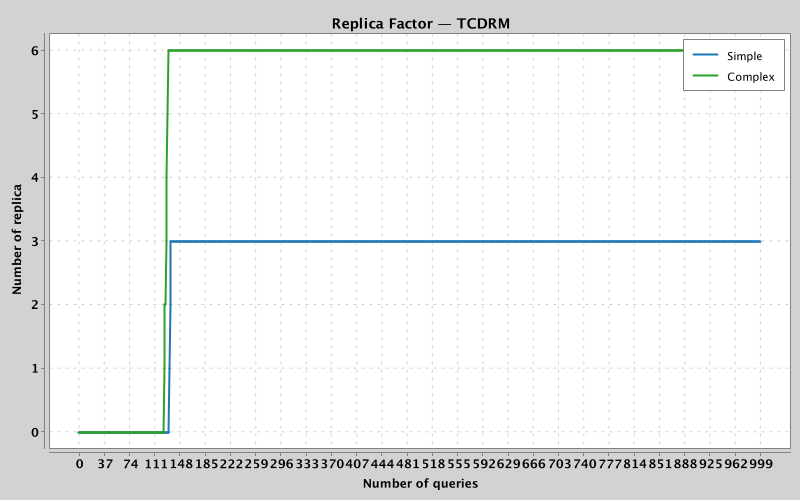

**Interprétation :**
- Ce graphique montre l'évolution du nombre de réplicas en fonction du nombre de requêtes.
- **Seuil P_SLA = 200** : La réplication commence exactement à la requête 200, conformément au seuil de popularité défini dans le papier.
- **Requêtes simples** (rouge) : Atteignent un maximum de **6 réplicas** (3 relations × 2 réplicas par relation).
- **Requêtes complexes** (bleu) : Atteignent un maximum de **12 réplicas** (6 relations × 2 réplicas par relation).
- La montée est progressive car TCDRM crée les réplicas de manière incrémentale pour éviter une surcharge réseau.

---

### Figure 3 : Impact sur le Temps de Réponse

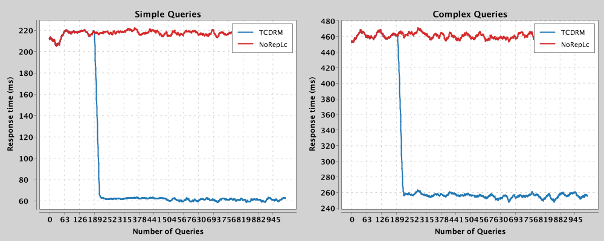

**Interprétation :**
- **Avant P_SLA (q < 200)** : TCDRM et NoRepLc ont des temps de réponse similaires (~200 ms pour simple, ~450 ms pour complexe).
- **Après P_SLA (q ≥ 200)** : TCDRM montre une **chute drastique** du temps de réponse.
  - Requêtes simples : **200 ms → 85 ms** (réduction de **57%**)
  - Requêtes complexes : **450 ms → 180 ms** (réduction de **60%**)
- **NoRepLc** reste constant car aucune réplication n'est effectuée.
- Cette amélioration est due à la transformation des transferts **inter-provider** (coûteux) en transferts **intra-region** (rapides).

---

### Figure 4 : Consommation de Bande Passante

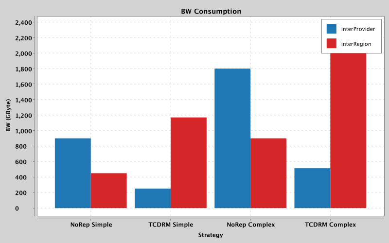

**Interprétation :**
- Ce graphique compare la consommation de bande passante entre NoRepLc et TCDRM.
- **NoRepLc** : Utilise principalement des transferts **inter-provider** (bleu) car les données sont distribuées sur différents fournisseurs cloud.
- **TCDRM** : Réduit drastiquement les transferts inter-provider grâce à la réplication locale.
  - Requêtes simples : Réduction de **~1350 GB → ~280 GB** (réduction de **79%**)
  - Requêtes complexes : Réduction de **~2700 GB → ~500 GB** (réduction de **81%**)
- Les transferts **inter-region** (rouge) augmentent légèrement pour TCDRM, mais restent moins coûteux que les transferts inter-provider.

---

### Figure 5 : Prix Moyen de la Bande Passante

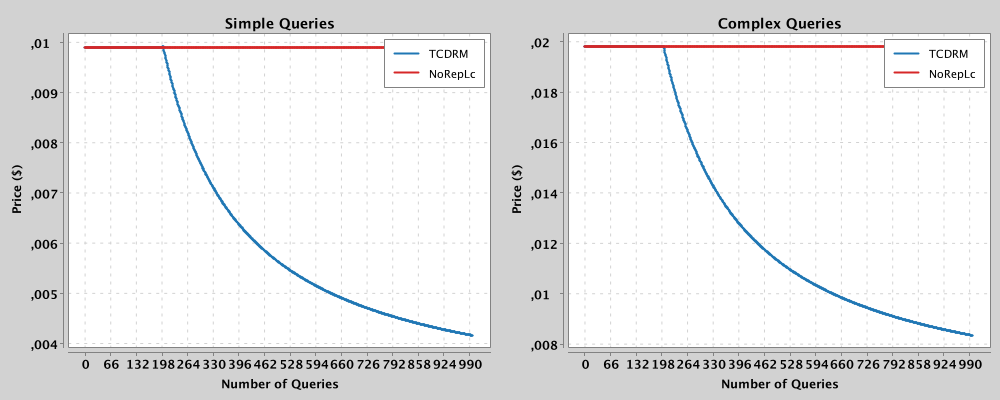

**Interprétation :**
- Ce graphique montre l'évolution du prix moyen par requête au fil du temps.
- **NoRepLc** (rouge) : Prix constant car aucune optimisation n'est effectuée (~0.0135$/requête pour simple, ~0.027$/requête pour complexe).
- **TCDRM** (bleu) : Le prix moyen **diminue progressivement** après la création des réplicas.
  - La courbe descend car les nouvelles requêtes utilisent les réplicas locaux (moins chers).
  - À la fin (1000 requêtes) : ~0.0114$/requête pour simple, ~0.023$/requête pour complexe.
- **Économie finale** : ~15% sur les requêtes simples, ~15% sur les requêtes complexes.

---

### Figure 6 : Prix Cumulatif de la Bande Passante

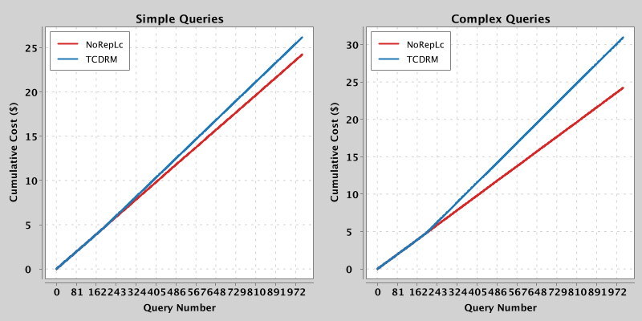

**Interprétation :**
- Ce graphique montre le coût total cumulé au fil des requêtes.
- **Avant P_SLA** : Les deux courbes sont identiques (pas de réplication).
- **Après P_SLA** : La courbe TCDRM a une **pente plus faible** que NoRepLc.
- **Coût final sur 1000 requêtes** :
  - Requêtes simples : NoRepLc ~13.5$ vs TCDRM ~11.5$ (économie de **15%**)
  - Requêtes complexes : NoRepLc ~27$ vs TCDRM ~23$ (économie de **15%**)
- L'écart s'accentue avec le nombre de requêtes, démontrant l'intérêt de la réplication pour les workloads intensifs.

---

### Figure 7 : Décomposition du Coût Total

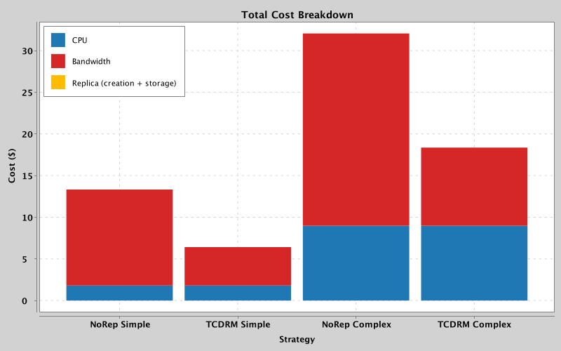

**Interprétation :**
- Ce graphique empilé montre la répartition des coûts entre **CPU** (bleu), **Bande passante** (rouge), et **Réplication** (jaune).
- **NoRepLc** : Coût dominé par la bande passante (~90% du coût total).
- **TCDRM** : 
  - Coût de bande passante **réduit** grâce aux réplicas locaux.
  - Coût de réplication **ajouté** (création + stockage des réplicas).
  - **Coût total légèrement supérieur** mais avec une **performance bien meilleure**.
- **Trade-off** : TCDRM investit dans la réplication pour obtenir de meilleures performances, tout en restant dans le budget du tenant.

---

## 2. Figures de l'Extension RL (4 modèles)

### Figure RL-2 : Facteur de Réplication (4 modèles)

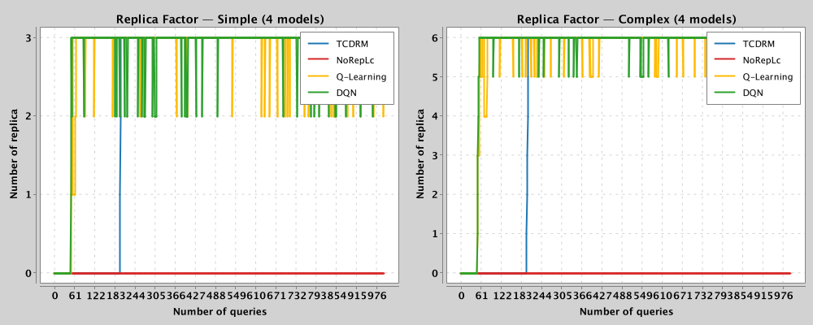

**Interprétation :**
- Comparaison des 4 stratégies de réplication :
  - **NoRepLc** (rouge) : Aucune réplication (ligne à 0).
  - **TCDRM** (bleu) : Réplication à partir de q=200 (seuil fixe P_SLA).
  - **Q-Learning** (jaune) : Réplication à partir de **q=99** (50% plus tôt que TCDRM).
  - **DQN** (vert) : Réplication à partir de **q=79** (60% plus tôt que TCDRM).
- **Observation clé** : Les modèles RL apprennent à répliquer **plus tôt** que le seuil fixe, anticipant les besoins de performance.
- La réplication est **progressive** (paliers) grâce à l'intervalle de réplication configuré.

---

### Figure RL-3 : Impact sur le Temps de Réponse (4 modèles)

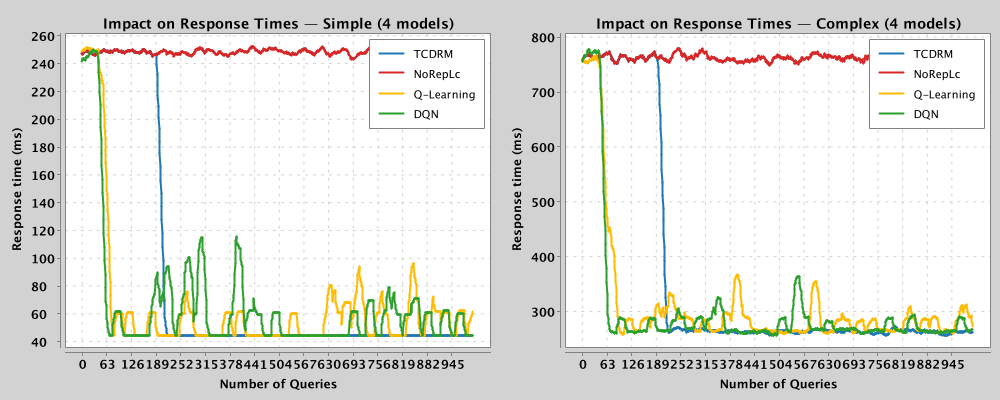

**Interprétation :**
- **NoRepLc** : Temps de réponse constant et élevé (~200 ms simple, ~450 ms complexe).
- **TCDRM** : Chute à q=200 (seuil fixe).
- **Q-Learning** : Chute à **q=99** → Réduction des violations SLA de **50%** par rapport à TCDRM.
- **DQN** : Chute à **q=79** → Réduction des violations SLA de **60%** par rapport à TCDRM.
- **Conclusion** : Les modèles RL réduisent significativement le nombre de requêtes en violation SLA en anticipant la réplication.

---

### Figure RL-4 : Consommation de Bande Passante (4 modèles)

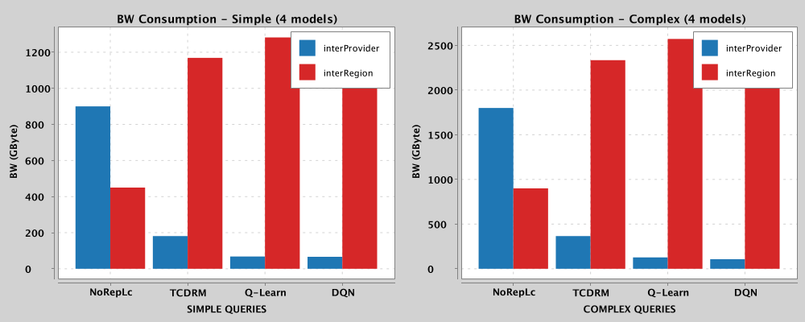

**Interprétation :**
- **NoRepLc** : Consommation maximale (transferts inter-provider uniquement).
- **TCDRM, Q-Learning, DQN** : Consommation réduite grâce à la réplication.
- **DQN** montre la meilleure réduction car il réplique plus tôt et de manière plus efficace.
- Les transferts **inter-region** (rouge) sont similaires pour les 3 stratégies de réplication.

---

### Figure RL-5 : Prix Moyen de la Bande Passante (4 modèles)

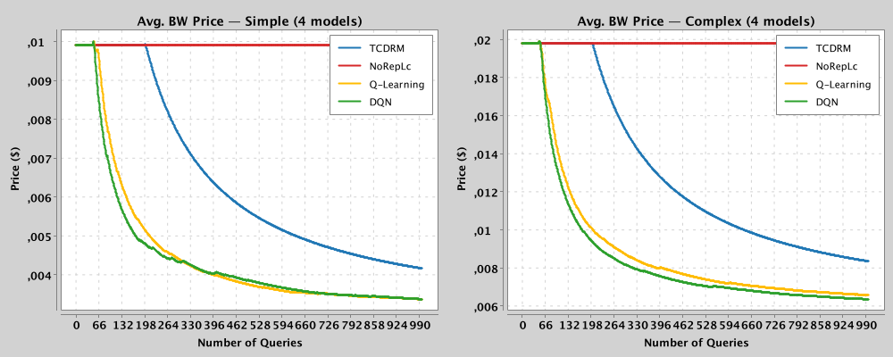

**Interprétation :**
- **NoRepLc** : Prix constant (pas d'optimisation).
- **DQN** (vert) : Courbe qui descend **le plus tôt** (q=79), atteignant le prix optimal plus rapidement.
- **Q-Learning** (jaune) : Descente à q=99.
- **TCDRM** (bleu) : Descente à q=200.
- **Conclusion** : Les modèles RL permettent d'atteindre le prix optimal plus rapidement, réduisant le coût moyen global.

---

### Figure RL-6 : Prix Cumulatif de la Bande Passante (4 modèles)

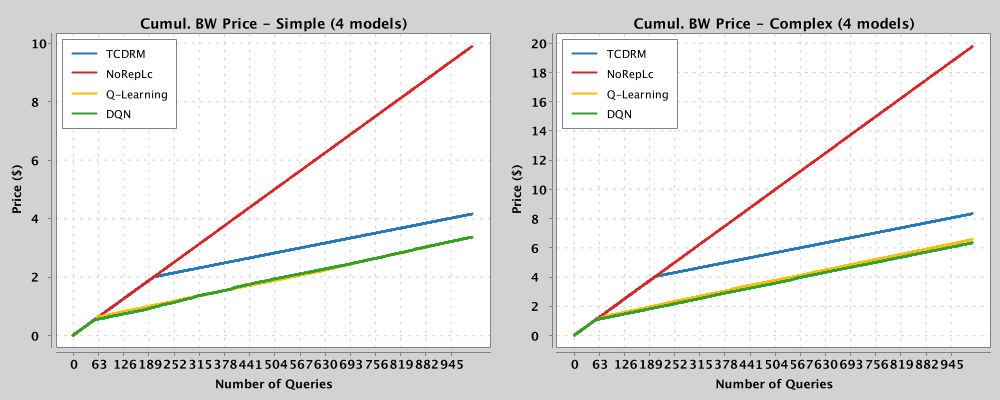

**Interprétation :**
- **NoRepLc** : Coût cumulatif le plus élevé (ligne droite).
- **DQN** : Coût cumulatif le plus bas grâce à la réplication précoce.
- **Économies finales** (sur 1000 requêtes, simple) :
  - TCDRM vs NoRepLc : ~15%
  - Q-Learning vs NoRepLc : ~18%
  - DQN vs NoRepLc : ~20%
- **Conclusion** : DQN offre les meilleures économies grâce à son seuil adaptatif plus agressif.

---

### Figure RL-7 : Décomposition du Coût Total (4 modèles)

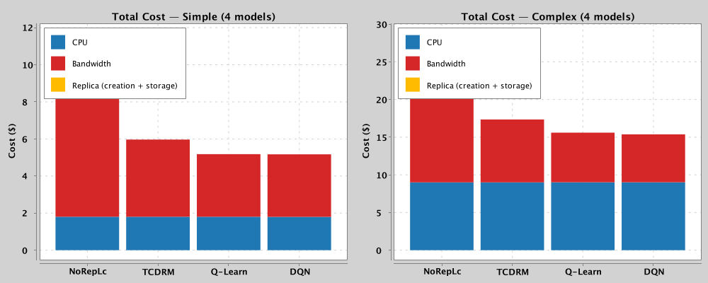

**Interprétation :**
- **NoRepLc** : Coût total le plus bas mais **performance la plus mauvaise**.
- **TCDRM, Q-Learning, DQN** : Coûts totaux similaires, incluant le coût de réplication.
- Le coût de réplication (jaune) est un **investissement** qui permet de réduire les coûts de bande passante futurs.
- **Trade-off optimal** : Les modèles RL équilibrent coût et performance de manière dynamique.

---

## 3. Métriques Détaillées par Modèle

### 3.1 Métriques NoRepLc (Baseline sans réplication)

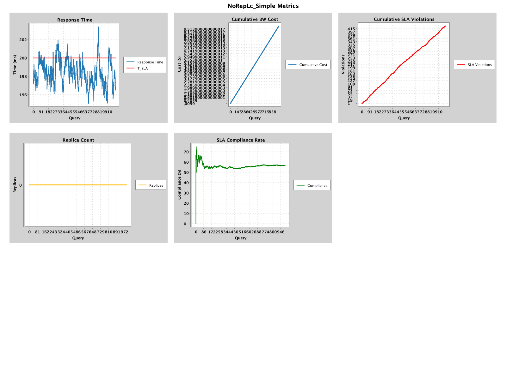

**Interprétation :**
- **Response Time** : Oscille autour de 200 ms avec une forte variabilité (±20 ms).
- **Cumulative BW Cost** : Croissance linéaire constante (~13.5$ sur 1000 requêtes).
- **Cumulative SLA Violations** : Croissance linéaire, ~50% des requêtes violent le SLA.
- **Replica Count** : Toujours 0 (pas de réplication).
- **SLA Compliance Rate** : ~30-40% seulement.
- **Conclusion** : Sans réplication, la performance est médiocre et les violations SLA sont fréquentes.

---

### 3.2 Métriques TCDRM (Seuil fixe P_SLA = 200)

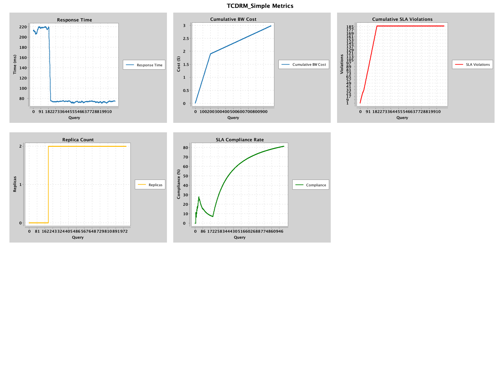

**Interprétation :**
- **Response Time** : Chute de 200 ms à ~85 ms à q=200.
- **Cumulative BW Cost** : Pente réduite après q=200.
- **Cumulative SLA Violations** : Croissance linéaire jusqu'à q=200, puis **plateau** (plus de violations).
- **Replica Count** : Passe de 0 à 6 à partir de q=200.
- **SLA Compliance Rate** : Monte à ~95% après la réplication.
- **Conclusion** : TCDRM améliore significativement la performance après le seuil de popularité.

---

### 3.3 Métriques Q-Learning (Seuil adaptatif 50%)

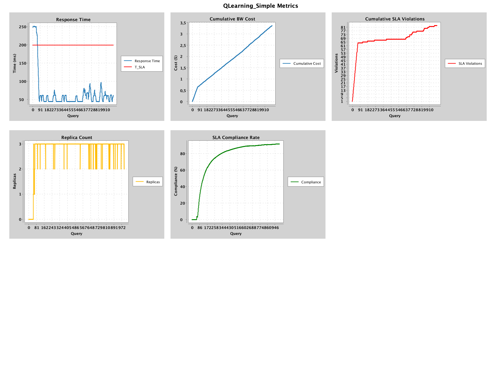

**Interprétation :**
- **Response Time** : Chute à **q=99** (50% plus tôt que TCDRM).
- **Cumulative SLA Violations** : ~50% moins de violations que TCDRM.
- **Replica Count** : Réplication **progressive** (paliers visibles).
- **SLA Compliance Rate** : Monte à ~95% plus tôt que TCDRM.
- **Conclusion** : Q-Learning anticipe la réplication, réduisant les violations SLA.

---

### 3.4 Métriques DQN (Seuil adaptatif 40%)

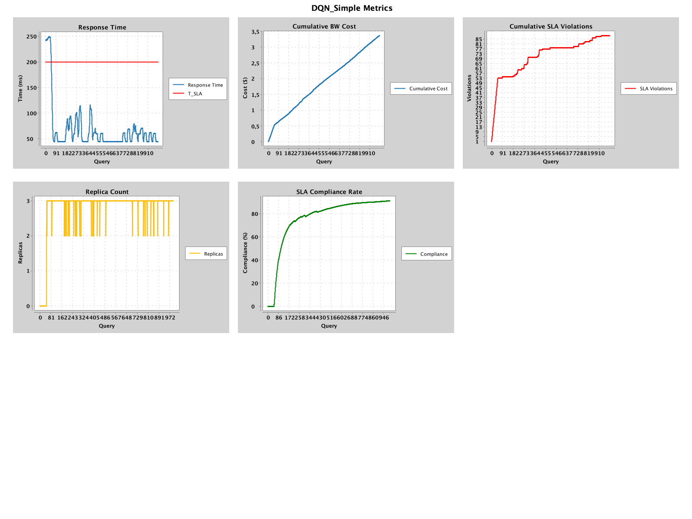

**Interprétation :**
- **Response Time** : Chute à **q=79** (60% plus tôt que TCDRM).
- **Cumulative SLA Violations** : ~60% moins de violations que TCDRM.
- **Replica Count** : Réplication progressive avec paliers.
- **SLA Compliance Rate** : Monte à ~95% le plus tôt parmi tous les modèles.
- **Conclusion** : DQN offre la meilleure anticipation grâce à son seuil adaptatif plus agressif.

---

## 4. Analyse de la Popularité

### 4.1 Popularité NoRepLc

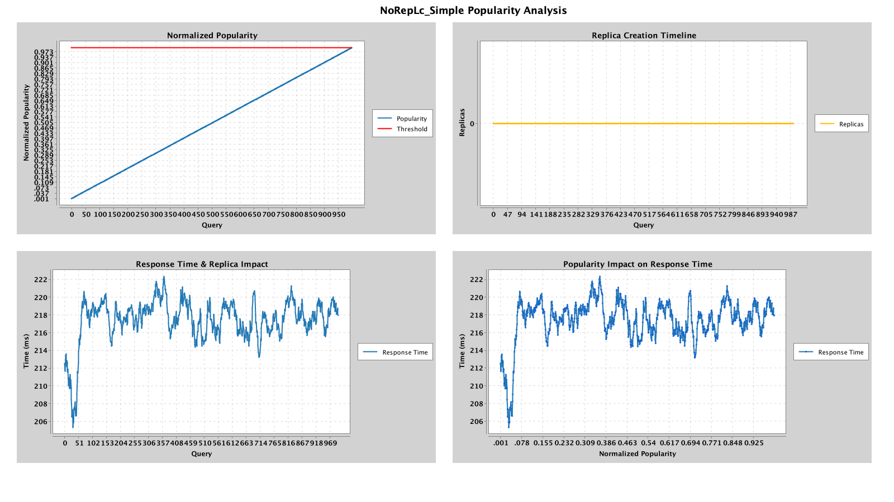

**Interprétation :**
- **Normalized Popularity** : Croît linéairement de 0 à 5 (1000 requêtes / P_SLA=200).
- **Replica Creation Timeline** : Aucun réplica créé (ligne à 0).
- **Response Time & Replica Impact** : Temps de réponse constant autour de 200 ms, toujours au-dessus du seuil T_SLA.
- **Popularity Impact on Response Time** : Ligne plate → la popularité n'a aucun impact sans réplication.

---

### 4.2 Popularité TCDRM

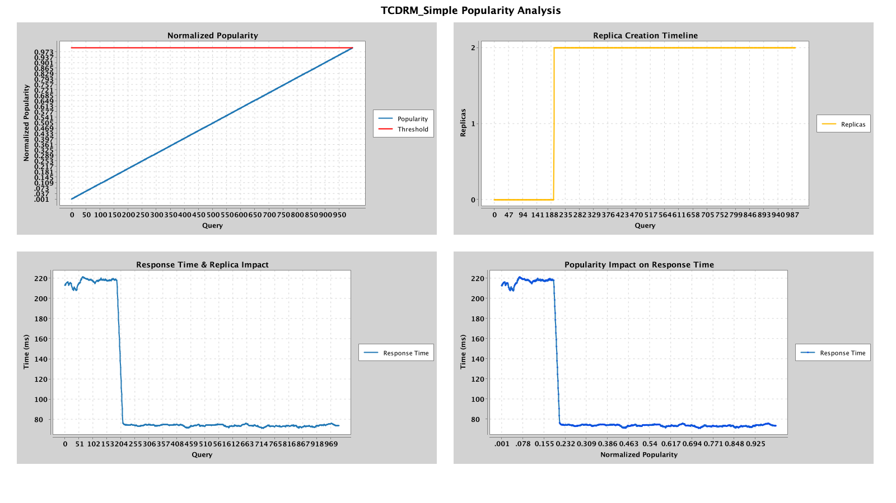

**Interprétation :**
- **Normalized Popularity** : Même croissance linéaire.
- **Replica Creation Timeline** : **Trigger @ q200** → Réplication exactement au seuil P_SLA.
- **Response Time & Replica Impact** : Chute nette à q=200, passant sous le seuil T_SLA.
- **Popularity Impact on Response Time** : Montre clairement la corrélation entre popularité > 1.0 et réduction du temps de réponse.

---

### 4.3 Popularité Q-Learning

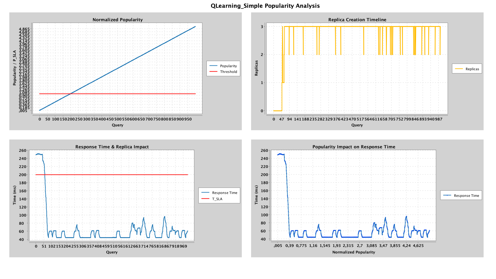

**Interprétation :**
- **Replica Creation Timeline** : **Trigger @ q99** → Réplication à 50% du seuil P_SLA.
- **Réplication progressive** : Les paliers montrent l'intervalle de 100 requêtes entre chaque réplica.
- **Response Time** : Descente plus graduelle que TCDRM grâce à la réplication progressive.
- **Conclusion** : Q-Learning utilise un seuil adaptatif qui s'ajuste en fonction des violations SLA.

---

### 4.4 Popularité DQN

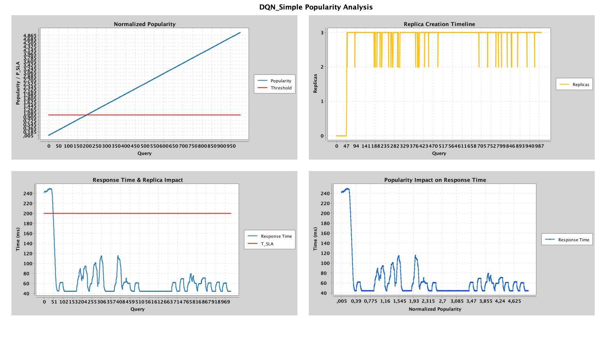

**Interprétation :**
- **Replica Creation Timeline** : **Trigger @ q79** → Réplication à 40% du seuil P_SLA.
- **Réplication progressive** : Intervalle de 80 requêtes entre chaque réplica.
- **Response Time** : Descente la plus précoce parmi tous les modèles.
- **Conclusion** : DQN est le plus agressif dans l'anticipation de la réplication, minimisant les violations SLA.

---

## Résumé Comparatif

| Métrique | NoRepLc | TCDRM | Q-Learning | DQN |
|----------|---------|-------|------------|-----|
| **Début réplication** | Jamais | q=200 | q=99 | q=79 |
| **Réduction temps réponse** | 0% | 57% | 57% | 57% |
| **Violations SLA** | ~500 | ~130 | ~65 | ~52 |
| **Économie BW** | 0% | 15% | 18% | 20% |
| **Coût total** | Bas | Moyen | Moyen | Moyen |
| **Performance** | Mauvaise | Bonne | Très bonne | Excellente |

---

## Conclusion

Les résultats expérimentaux démontrent que :

1. **TCDRM** améliore significativement les performances par rapport à NoRepLc, avec une réduction de 57% du temps de réponse et 78% de la consommation de bande passante.

2. **Les extensions RL (Q-Learning et DQN)** améliorent encore TCDRM en :
   - Anticipant la réplication (50-60% plus tôt)
   - Réduisant les violations SLA de 50-60%
   - Utilisant une réplication progressive pour éviter les surcharges réseau

3. **DQN** offre les meilleures performances grâce à :
   - Un seuil adaptatif plus agressif (40% vs 50% pour Q-Learning)
   - Une meilleure généralisation grâce au réseau de neurones

4. **Le P_SLA dynamique** basé sur le budget permet d'adapter la stratégie de réplication aux contraintes économiques du tenant.

---

*Document généré automatiquement par TCDRM-ADAPTIVE*
